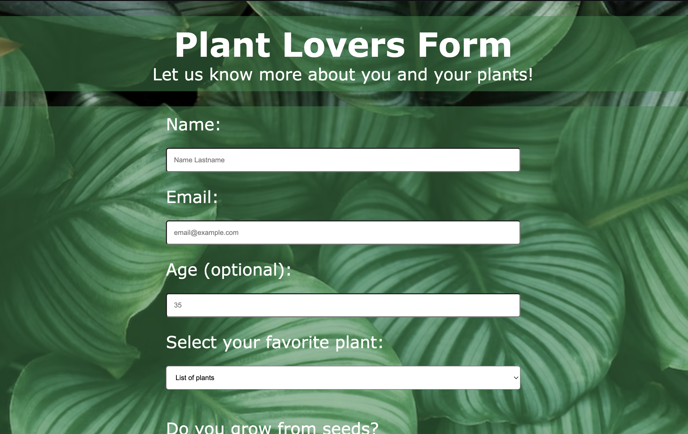

# Survey Form from FreeCodeCamp
A solution for the [Survey Form project on FreeCodeCamp](https://www.freecodecamp.org/learn/2022/responsive-web-design/build-a-survey-form-project/build-a-survey-form).

## Process

I completed this project almost an year ago, in spring 2022. After learning some more CSS, I changed the style and tried to make some improvements.

I also added a media query.

## Screenshot

### New style

### Old style

## Acknowledgments

Background by [SVGBackgrounds.com](https://www.svgbackgrounds.com/).
